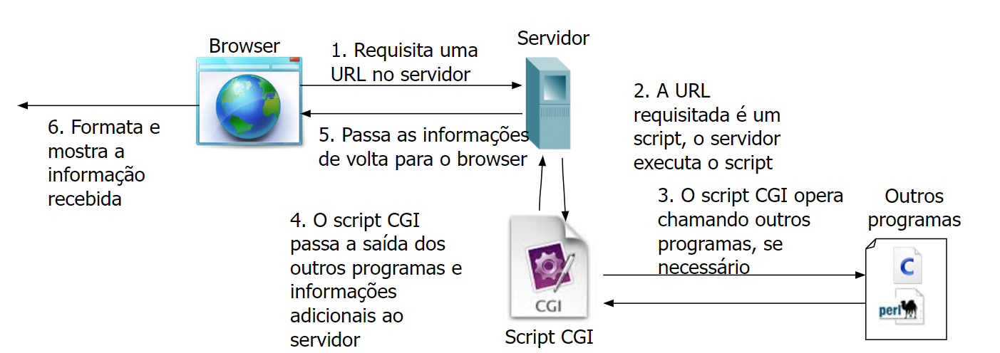

# Programação para Servidores - _Back-end_

A programação do lado servidor (_Back-end_) pode ser feita com diversas linguagens de programação (praticamente todas de mercado possuem este suporte), com diversas estratégias e paradigmas de codificação e _runtime_ (compilação/execução e interpretação/execução).

## Back-end

É no _back-end_ em que as regras de negócio e integrações são desenvolvidas, muitas vezes sendo agnóstico ao seu consumidor (_front ends_, __APIs__, dentre outros).

Uma boa escolha de uma linguagem de programação é o passo inicial para o desenvolvimento - seja _front-end_ ou _front-end_.
O critério crucial é selecionar algo que seja de grande suporte no mercado e que seja confortável para uma fábrica de software desenvolver - e que de preferência, tenha profissionais que sejam experientes na mesma.
> Evite dizer que alguém domina determinada linguagem - sempre existem detalhes que não são de domínio.

`Uma ajuda é sempre bem-vinda:` _[Backend Languages: The First Step for Becoming a Backend Web Developer](https://www.scaler.com/topics/software-engineering/backend-languages/)_

> - _[back end](https://dictionary.cambridge.org/dictionary/english/back-end#cald4-1-3)_  substantivo composto, que modifica um substantivo (O _back end_ das _APIs_ é em Java)
> - _[back-end](https://dictionary.cambridge.org/dictionary/english/back-end#cald4-2-3)_  adjetivo composto, que modifica um substantivo (Sou um desenvolvedor _back-end_)

## Evolução e história

### CGI

**O que é CGI?**

CGI, ou _Common Gateway Interface_, é um protocolo padrão que permite que os servidores web interajam com programas remotos para produzir conteúdo dinâmico para uma web interativa, aonde os servidores web executam programas em resposta às entradas dos usuários, como preenchimento de formulários.

**Como funciona o fluxo de execução do CGI?**

1. **Requisição do Cliente**: O cliente (por exemplo, um navegador) envia uma solicitação HTTP para o servidor web.
2. **Decisão do Servidor**: Se a solicitação é identificada como uma chamada CGI (geralmente com base na extensão do URL ou no diretório onde está localizado), o servidor invoca o _script_ ou programa CGI apropriado.
3. **Execução do _Script_**: O _script_ é executado e processa os dados, se houver. Por exemplo, ele pode ler um banco de dados, processar entradas de formulário ou realizar outras operações.
4. **Resposta**: O _script_ cria uma resposta (geralmente uma página HTML), que é enviada de volta ao servidor web.
5. **Envio ao Cliente**: O servidor web envia essa resposta de volta ao cliente.

**Principais Deficiências do CGI:**

- **Performance**: A cada requisição, um novo processo é criado para tratar a solicitação. Isso pode ser ineficiente, especialmente sob alta carga, pois consome muito tempo de processamento.
  
- **Segurança**: _Scripts_ CGI mal escritos podem ser explorados por invasores, levando a vulnerabilidades de segurança.
  
- **Complexidade**: Pode ser mais complexo de configurar e manter, especialmente em comparação com abordagens mais modernas como _frameworks_ de aplicativos web

### Linguagens de script (_Scripting languages_)

Também conhecidas como linguagens de script, são linguagens de programação utilizadas principalmente para a criação de conteúdo dinâmico na web.
Estas linguagens são interpretadas em tempo real, ao contrário das linguagens compiladas que requerem um passo prévio de compilação antes da execução.

Este modelo interpretado permite uma maior flexibilidade e rapidez no desenvolvimento, sendo especialmente útil em ambientes que requerem constantes atualizações e mudanças, como é o caso das aplicações web.

#### PHP

PHP é uma linguagem de script _open-source_ amplamente usada para o desenvolvimento web. Surgida em 1994, PHP rapidamente se tornou popular devido à sua facilidade de uso, integração direta com bancos de dados e sua natureza _open-source_. 
Ao contrário de ASP, que é fortemente associada ao ambiente Windows, PHP é plataforma-agnóstica, o que significa que pode ser executado em diversos sistemas operacionais, incluindo Linux, Unix e Windows.

##### Características da Sintaxe PHP

- PHP é incorporado em páginas HTML por meio de _tags_ especiais (`<?php ... ?>` ou `<?= ... ?>` para saída curta).
- As variáveis no PHP são prefixadas com o símbolo `$`, por exemplo, `$variavel`.
- O PHP é uma linguagem fracamente tipada, o que significa que você não precisa declarar tipos de dados.
- Suporta uma variedade de operadores: aritméticos, de comparação, lógicos, entre outros.
- Os arrays podem ser indexados numericamente ou por _strings_, e o PHP também suporta arrays multidimensionais.
- O PHP também tem suporte para Programação Orientada a Objetos (a partir do PHP5).
- Sintaxe semelhante a de C, Java e Perl
  
##### Evoluções Significativas por Versão

- **PHP 3 (1998)**: Reescrito por Andi Gutmans e Zeev Suraski. Introduziu uma variedade de novos recursos e uma melhor integração com bancos de dados.
  
- **PHP 4 (2000)**: Apresentou o Zend Engine, um intérprete melhorado para PHP. Também incluiu recursos como sessões e saída em _buffer_.

- **PHP 5 (2004)**: Introduziu o modelo de Programação Orientada a Objetos. Extensões PDO (PHP Data Objects) foram adicionadas para acesso abstrato ao banco de dados, e foi melhorado o suporte a XML e serviços web.
  
- **PHP 7 (2015)**: Foi uma grande atualização que trouxe melhorias significativas de desempenho, novos operadores (como o operador de coalescência nula), tipos de retorno, declarações de tipo escalares, entre outras adições.

- **PHP 8 (2020)**: Introduziu o compilador JIT (Just-In-Time), tipos de propriedades de classe, match expressions, construtores de propriedades promovidas e muitas outras funcionalidades.

##### Interação com Bancos de Dados

- **Relacionais**: PHP tem extenso suporte para bancos de dados relacionais como MySQL, PostgreSQL, SQLite e outros, principalmente através das extensões PDO, `mysqli`, e outras específicas para cada DBMS.

- **Não Relacionais**: PHP também pode interagir com bancos de dados NoSQL como MongoDB, Couchbase, entre outros, através de extensões específicas ou bibliotecas.

##### Consumo de Serviços e _APIs_

- **SOAP**: PHP tem suporte nativo para SOAP através da extensão `soap`, que permite aos desenvolvedores criar e consumir serviços web SOAP.

- **REST**: A comunicação com _APIs_ REST pode ser facilmente realizada em PHP usando funções como `file_get_contents()` ou bibliotecas como cURL, Guzzle, entre outras.

#### ASP

ASP, que significa "Active Server Pages", é uma tecnologia de desenvolvimento web criada pela Microsoft como parte de sua solução IIS (Internet Information Services) em meados da década de 1990. Originalmente, ASP permitia a criação de páginas web dinâmicas usando _script_s do lado do servidor, geralmente escritos em VB_Script_.

##### Características da Sintaxe ASP

- ASP é incorporado em páginas HTML por meio de _tags_ especiais (`<% ... %>`).
- As variáveis em ASP não precisam ser declaradas com um tipo específico e são normalmente prefixadas com o símbolo `%`.
- Por padrão, ASP utilizava VB_Script_, embora também suportasse J_Script_ (a versão da Microsoft do Java_Script_).
- Procedimentos, como loops e condicionais, são muito semelhantes aos encontrados em linguagens de programação tradicionais.
  
##### Evoluções Significativas

- **ASP Clássico**: Esta foi a primeira versão do ASP e predominou na web até o início dos anos 2000.
  
- **ASP.NET**: Lançado em 2002, o ASP.NET representou uma revolução na tecnologia ASP, mudando de _script_ing para uma abordagem mais robusta baseada em framework, com suporte total para linguagens .NET como C# e VB.NET.
  
- **ASP.NET MVC**: Introduzido em 2009, forneceu uma alternativa ao ASP.NET tradicional, baseado em WebForms, oferecendo um framework model-view-controller para criar aplicativos web mais escaláveis e testáveis.

- **ASP.NET Core**: Lançado em 2016, é uma reformulação do ASP.NET, otimizado para desenvolvimento em nuvem e capaz de ser executado em várias plataformas, incluindo Linux e macOS.

##### ASP e Interação com Bancos de Dados

- ASP clássico costumava interagir com bancos de dados, principalmente através de ADO (ActiveX Data Objects).
  
- ASP.NET e versões subsequentes têm acesso a uma gama muito mais ampla de opções de banco de dados, principalmente através de tecnologias como Entity Framework.

##### ASP e Consumo de Serviços e _APIs_

- ASP.NET e ASP.NET Core oferecem suporte robusto para a criação e consumo de serviços web, tanto SOAP quanto RESTful, através de bibliotecas e _ específicos_ como WCF (Windows Communication Foundation) e _Web API_.

Em resumo, enquanto o ASP clássico foi uma das primeiras tentativas de proporcionar páginas web dinâmicas do lado do servidor, a evolução para ASP.NET e, mais recentemente, ASP.NET Core mostra o compromisso da Microsoft em fornecer ferramentas poderosas e flexíveis para os desenvolvedores web. A mudança para plataformas abertas e multiplataforma com ASP.NET Core também destaca uma nova direção em seu desenvolvimento.

#### Desvantagens e Deficiências de _Script_ing Languages no Servidor

_Script_ing languages, como ASP (clássico) e PHP, têm sido ferramentas poderosas para desenvolvimento web por muitos anos. No entanto, apesar de seus pontos fortes, eles também vêm com várias desvantagens e deficiências:

##### Performance

- **Interpretação**: Sendo linguagens interpretadas, _script_ing languages normalmente têm desempenho inferior a linguagens compiladas como C++ ou Java. Isso pode se tornar um gargalo em aplicações web de alto tráfego ou operações intensivas de backend.

##### Escalabilidade

- **Modelo de Thread**: Muitas _script_ing languages foram originalmente projetadas com um modelo de thread único ou baseado em processos, o que pode limitar sua escalabilidade em comparação com linguagens ou plataformas projetadas para concorrência desde o início.

##### Manutenção e Legibilidade

- **Código Espaguete**: Devido à natureza dinâmica e flexível das _script_ing languages, é fácil para os desenvolvedores escreverem código desorganizado ou "espaguete", tornando a manutenção mais difícil.

- **Falta de Tipagem Forte**: A falta de tipagem forte em muitas _script_ing languages pode levar a bugs sutis que são difíceis de detectar e corrigir.

- **Mistura de HTML e _script_ing**: Difícil a separação do _front end_ e _back end_

##### Segurança

- **Vulnerabilidades Comuns**: Aplicações web escritas em _script_ing languages têm sido frequentemente alvo de vulnerabilidades comuns, como injeção de SQL e ataques XSS, especialmente quando as melhores práticas não são seguidas.

##### Portabilidade e Dependência de Plataforma

- **Plataforma Específica**: Enquanto PHP é geralmente considerado multiplataforma, o ASP clássico estava atrelado à plataforma Windows, limitando sua portabilidade.

##### Evolução da Tecnologia

- **Transição para Novas Versões**: A transição de ASP clássico para ASP.NET, por exemplo, não foi simples, pois envolvia mudar de uma linguagem de _script_ para uma linguagem baseada em framework. Migrar projetos antigos pode ser desafiador e caro.

##### Comunidade e Suporte

- **Descontinuação**: Linguagens mais antigas ou versões específicas (como o ASP clássico) podem perder o suporte ou ser descontinuadas, tornando mais difícil manter ou atualizar aplicações existentes.

Em resumo, enquanto _scripting languages_ oferecem rapidez de desenvolvimento e flexibilidade, essas vantagens também podem levar a desvantagens em termos de desempenho, segurança, e manutenibilidade.

### Linguagens de programação

O desenvolvimento web experimentou uma diversidade crescente de tecnologias e abordagens ao longo dos anos. Uma das áreas que testemunhou a maior variedade é a das linguagens de programação e frameworks. Este texto busca apresentar uma introdução sucinta a algumas das linguagens e frameworks mais relevantes atualmente: Jakarta EE, .NET, Python, Go, Node.js e Ruby on Rails.

#### Jakarta EE

Anteriormente conhecido como Java EE (Enterprise Edition), o Jakarta EE representa a evolução dos padrões de desenvolvimento baseados em Java para aplicações empresariais. 
Sua força reside na robustez e escalabilidade, tornando-o uma escolha popular para grandes sistemas web. 
Com uma vasta gama de APIs para desenvolvimento, Jakarta EE é uma solução integral para construção de aplicações empresariais.
Conta com frameworks de mercado que otimizam o desenvolvimento, como o _Spring Framework_

- **Portabilidade**: Baseado na linguagem Java, o Jakarta EE é portável entre diferentes sistemas e plataformas.
- **Especificações Integradas**: Contém várias especificações para abordar aspectos como persistência (JPA), mensagens (JMS) e serviços web (JAX-RS).
- **CDI (Contexts and Dependency Injection)**: Permite a injeção de dependências e gerenciamento de ciclo de vida.
- **Segurança**: Provê um modelo de segurança robusto.
- **Concorrência e Multithreading**: Suporte nativo para desenvolvimento de aplicações concorrentes.

#### .NET

Desenvolvido pela Microsoft, o .NET é um framework multifuncional que suporta várias linguagens de programação, incluindo C#, VB.NET e F#. Originalmente mais centrado em aplicações Windows, o .NET evoluiu com o lançamento do .NET Core, que é open-source e cross-platform, expandindo seu alcance para desenvolvimento web em diversos sistemas operacionais.

- **Múltiplas Linguagens**: Suporte a várias linguagens, como C#, VB.NET e F#.
- **ASP.NET**: Framework para desenvolvimento web.
- **Entity Framework**: ORM (Object-Relational Mapping) para integração com bancos de dados.
- **Blazor**: Framework para construção de aplicações web usando C# em vez de JavaScript.
- **Interoperabilidade**: Facilidade de integração com outras tecnologias e bibliotecas.

#### Python

Embora Python seja uma linguagem de propósito geral, sua simplicidade e legibilidade a tornaram uma escolha popular também no desenvolvimento web. Frameworks como Django e Flask possibilitam a criação de aplicações web robustas com Python, oferecendo flexibilidade e um desenvolvimento mais ágil.

- **Sintaxe Clara**: Fácil de ler e escrever.
- **Biblioteca Padrão Ampla**: Uma vasta gama de módulos e pacotes inclusos.
- **Frameworks Web**: Django, Flask, Pyramid, entre outros.
- **Gerenciadores de Pacote**: pip e PyPI permitem fácil gestão e distribuição de pacotes.
- **Dinâmico e Interpretado**: Permite desenvolvimento rápido e interativo.

#### Go (ou Golang)

Criada pela Google, Go é uma linguagem que combina simplicidade com desempenho. No contexto web, Go oferece ferramentas nativas para criação de servidores web e se destaca pela sua performance e concorrência eficiente, sendo uma opção crescentemente popular para backends e microserviços.

- **Estatisticamente Tipado**: Combina a segurança de linguagens estaticamente tipadas com a simplicidade de linguagens dinâmicas.
- **Concorrência**: Goroutines e canais para gestão eficiente de tarefas concorrentes.
- **Garbage Collector**: Gerenciamento automático de memória.
- **Pacotes Standard**: Bibliotecas nativas ricas para desenvolvimento web, manipulação de dados, e mais.
- **Compilado**: Gera binários nativos, o que frequentemente resulta em melhor desempenho.

#### Node.js

Não exatamente uma linguagem, mas um runtime, Node.js permite a execução de JavaScript no servidor. Sua natureza assíncrona e baseada em eventos torna-se ideal para aplicações web em tempo real. Com um ecossistema vasto, representado pelo npm (Node Package Manager), Node.js facilita a construção de aplicações escaláveis.

- **Assíncrono e Baseado em Eventos**: Modelo não bloqueante otimizado para I/O.
- **npm**: Um dos maiores ecossistemas de pacotes do mundo.
- **V8 Engine**: Motor JavaScript de alto desempenho desenvolvido pelo Google.
- **Empacotamento Modular**: Fácil de modularizar e reutilizar código.
- **Middleware**: Capacidade de usar middleware, como o Express.js, para simplificar tarefas comuns.

#### Ruby on Rails

Ruby on Rails, ou apenas Rails, é um framework escrito em Ruby focado no desenvolvimento web. Famoso por sua convenção sobre configuração e pela filosofia DRY (Don't Repeat Yourself), Rails busca simplificar o processo de desenvolvimento, permitindo aos desenvolvedores criar aplicações web de forma mais eficiente e intuitiva.

- **Convenção sobre Configuração**: Predefinições que eliminam decisões triviais.
- **DRY (Don't Repeat Yourself)**: Princípio fundamental para evitar repetição de código.
- **Active Record**: ORM para simplificar operações de banco de dados.
- **MVC (Model-View-Controller)**: Arquitetura padrão para organização de código.
- **Scaffolding**: Geração automática de código para operações CRUD básicas.
