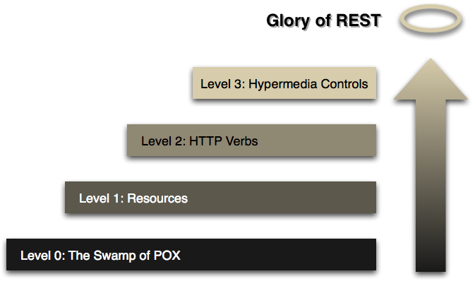
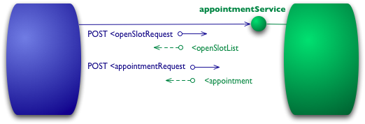
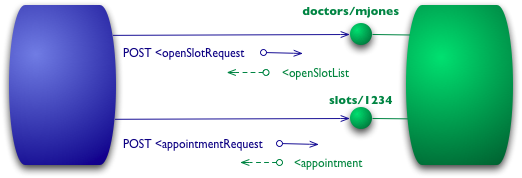
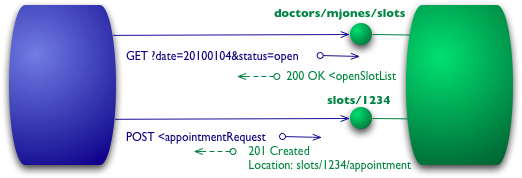
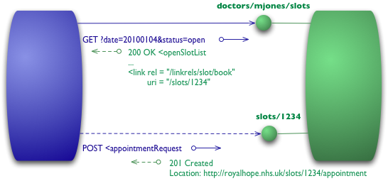

# Modelo de Maturidade de Richardson para APIs

O Modelo de Maturidade de Richardson, desenvolvido por Leonard Richardson, divide os elementos-chave de uma API RESTful em níveis, ajudando os desenvolvedores a entender sua evolução e a compreender os passos para alcançar um sistema totalmente RESTful.


> Fonte: <https://martinfowler.com/articles/images/richardsonMaturityModel/overview.png>

## **Nível 0 - O Pântano da POX** (*SW: Swamp of POX*)

- Usa uma única URI e um único método (frequentemente POST) para realizar todas as operações.
- Exemplo: SOAP.


> Fonte: <https://martinfowler.com/articles/images/richardsonMaturityModel/level0.png>

## **Nível 1 - Recursos** (*Resources*)

- Introduz uma variedade de URIs para identificar recursos individuais.


> Fonte: <https://martinfowler.com/articles/images/richardsonMaturityModel/level1.png>

## **Nível 2 - Verbos HTTP** (*HTTP Verbs*)

- Usa métodos HTTP (GET, POST, PUT, DELETE) para definir ações em recursos.
- As respostas são padronizadas usando códigos de status HTTP apropriados.


> Fonte: <https://martinfowler.com/articles/images/richardsonMaturityModel/level2.png>

## **Nível 3 - Controles Hipermedia** (*Hypermedia Controls / HATEOAS*)

- Adiciona informações dentro das respostas para informar ao cliente quais outras ações estão disponíveis (HATEOAS – *Hypermedia as the Engine of Application State*).


> Fonte: <https://martinfowler.com/articles/images/richardsonMaturityModel/level3.png>

## GLÓRIA DO RESTFUL

Se a API REST contempla os três níveis, ela pode ser considerada uma API RESTful!
Esse modelo pode ser utilizado como guia para squads que buscam melhorar o ecossistema interno de uma empresa. 

## Conclusões

- O nível 1 aborda a questão de lidar com a complexidade usando dividir e conquistar, dividindo um grande __hub__ de serviços em vários recursos.
- O nível 2 introduz um conjunto padrão de verbos para que possamos lidar com situações semelhantes, removendo variações desnecessárias.
- O nível 3 introduz a descoberta, fornecendo uma maneira de tornar um protocolo mais autodocumentado.
  
O resultado é um modelo que nos ajuda a pensar sobre o tipo de serviço HTTP que queremos fornecer e a enquadrar as expectativas das pessoas que desejam interagir com ele.

```text
FOWLER, Martin. Ricardson Maturity Level, 2023. Disponível em: <https://martinfowler.com/articles/richardsonMaturityModel.html>. Acesso em: 19 out. 2023.
```
