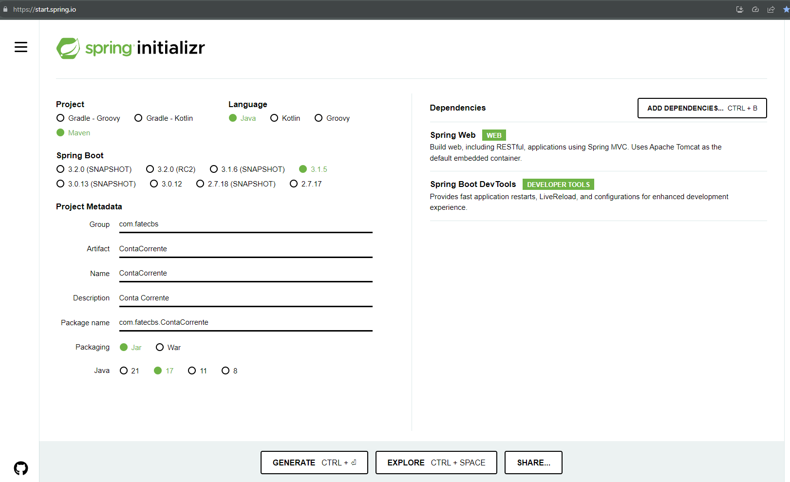

# Spring Initializr

O [Spring Initializr](https://start.spring.io/) é uma ferramenta online conveniente e muito utilizada para a criação rápida de estruturas básicas de projetos para aplicações Spring. Ele simplifica o processo de configuração inicial, permitindo aos desenvolvedores focarem no código específico do projeto ao invés de na configuração do ambiente.

Através do site [start.spring.io](https://start.spring.io/), pode-se facilmente definir aspectos do seu novo projeto, como:

- Tipo de projeto (Maven ou Gradle);
- Linguagem de programação (Java, Kotlin, ou Groovy);
- Versão do Spring Boot;
- Metadados do projeto (como nome, descrição, nome do pacote), e;
- Dependências iniciais.

Após configurar as opções, o Spring Initializr gera um projeto (pom.xml para Maven ou build.gradle para Gradle) e uma estrutura de diretórios básica.
Este projeto pode ser importado para uma IDE e usado como base para o desenvolvimento.

Muitas IDEs, como IntelliJ IDEA, Eclipse e VS Code, integram-se com o Spring Initializr, permitindo que os usuários gerem e importem projetos diretamente dentro da IDE.

Uma das principais vantagens é a capacidade de selecionar dependências conforme necessário para o projeto. Por exemplo, se você está construindo um serviço web, pode incluir dependências como 'Spring Web', ou para acesso a dados, pode adicionar 'Spring Data JPA'.

O Spring Initializr garante que as dependências selecionadas sejam compatíveis entre si, especialmente em relação à versão do Spring Boot. Isso reduz significativamente os problemas de incompatibilidade que podem surgir ao configurar manualmente um projeto Spring.

